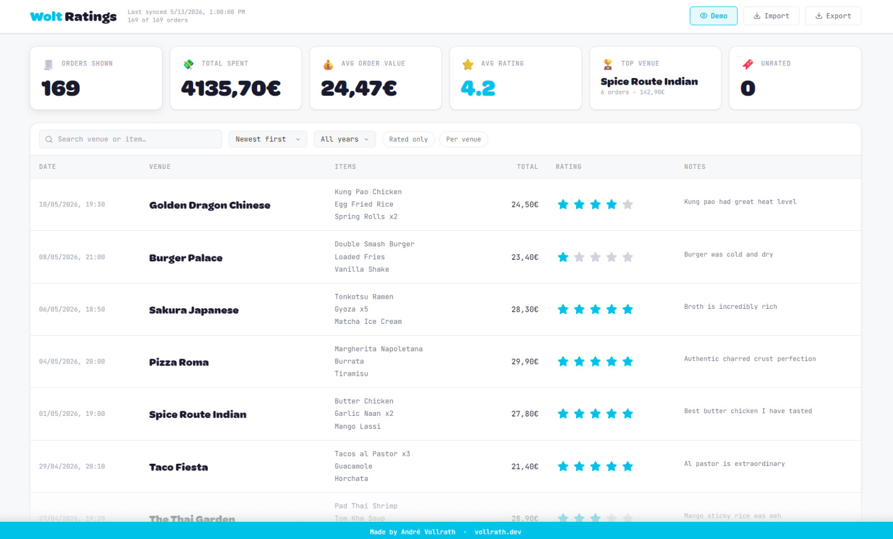

# Wolt Ratings

Your Wolt order history is basically a spreadsheet locked behind a bad UI. Wolt Ratings pulls it out, stores it locally, and gives you a proper dashboard to search, sort, rate, and annotate every order you've ever placed — no accounts, no cloud, no tracking.

<p align="center">
  
</p>

It's two things working together: a **Chrome extension** that silently captures your Wolt session token and syncs your full order history to a local JSON file, and a **Flask-served dashboard** at `http://localhost:5000` where all the useful stuff happens.

---

## What You Can Do

- **Search** orders by venue name or item
- **Sort** by date, rating, total value, or venue name
- **Filter by year** to focus on a specific period
- **Rate** any order with 1–5 stars and add a personal note
- **Per venue view** — collapse the list to one row per restaurant, showing total spend, average rating across all visits, and the date range of your orders
- **Highest rated sort** weights venues by both average rating and number of ratings, so a venue with 10 five-star visits ranks above one with 2
- **Click any venue** to open a detail modal with total spend, average rating, most ordered items, and full visit history with per-order star ratings
- **Stats bar** shows live totals for orders, spend, average order value, average rating, top venue, and unrated count — all reactive to your active filters
- **Import / export** your `orders_db.json` to back it up or move it between machines
- **Demo mode** — toggle in the header to load example data without touching your real orders

---

## Setup

```bash
pip install -r backend/requirements.txt
python backend/app.py
```

The backend starts at `http://localhost:5000` and serves the dashboard from `frontend/`.

---

## Loading the Extension

1. Open `chrome://extensions`
2. Enable **Developer mode**
3. Click **Load unpacked**
4. Select the `extension/` folder

<p align="center">
  
  <br />
  <em>The extension popup confirms your session token is captured and the backend is reachable before syncing.</em>
</p>

---

## First Sync

1. Start the backend: `python backend/app.py`
2. Open [wolt.com](https://wolt.com) and let the page load — the extension captures your session token from outgoing API request headers
3. Click the extension icon and confirm the token indicator is green
4. Hit **Sync Now**
5. Open `http://localhost:5000`

<p align="center">
  
  <br />
  <em>Venue modal: total spend, average rating, your most ordered items, and every past visit in one place.</em>
</p>

---

## Token Troubleshooting

If the indicator stays yellow, open your Wolt order history page and wait for it to finish loading — the extension needs to observe an outgoing API request. If it still won't turn green, sign out and back in to Wolt so a fresh request fires. Tokens live in `chrome.storage.session`, so a browser restart requires a new capture.

---

## Project Structure

```text
wolt-ratings/
|-- backend/
|   |-- app.py
|   |-- example_orders.json
|   |-- exchange_rates.json
|   |-- migrate_money.py
|   `-- requirements.txt
|-- extension/
|   |-- background.js
|   |-- content.js
|   |-- manifest.json
|   |-- popup.html / popup.js / popup.css
|   `-- icons/
|-- frontend/
|   |-- index.html
|   |-- app.js
|   |-- styles.css
|   |-- assets/
|   `-- fonts/
`-- screenshots/
```

`backend/orders_db.json` is created on first sync and is gitignored. Run `python backend/migrate_money.py` after updating an older local database so stored orders get normalized money fields.

---

## DB Schema

```json
{
  "last_synced": "2026-05-13T10:00:00+00:00",
  "orders": [
    {
      "purchase_id": "unique order id",
      "venue_name": "Restaurant name",
      "received_at": "13/05/2026, 19:30",
      "items": "Item one and Item two",
      "total_amount": "24,50 EUR",
      "total_amount_value": 24.5,
      "total_amount_currency": "EUR",
      "total_amount_eur": 24.5,
      "exchange_rate_to_eur": 1.0,
      "exchange_rate_date": "default",
      "status": "delivered",
      "user_custom_data": {
        "rating": 4,
        "notes": "Ask for extra sauce.",
        "last_edited": "2026-05-13T20:00:00+00:00"
      }
    }
  ]
}
```

| Field | Description |
|---|---|
| `purchase_id` | Stable Wolt order ID |
| `venue_name` | Restaurant name from Wolt |
| `received_at` | Normalized to `DD/MM/YYYY, HH:MM` |
| `total_amount` | Original Wolt display string shown in order rows |
| `total_amount_value` | Numeric value parsed from `total_amount` |
| `total_amount_currency` | Parsed ISO currency code, for example `EUR`, `SEK`, or `NOK` |
| `total_amount_eur` | Converted EUR value used for dashboard totals, averages, sorting, and venue stats |
| `exchange_rate_to_eur` | Rate used to convert from `total_amount_currency` to EUR |
| `exchange_rate_date` | Historical rate date, or `default` for EUR |
| `status` | Dashboard only shows `delivered` orders |
| `user_custom_data.rating` | Local star rating, 0–5 |
| `user_custom_data.notes` | Local free-text note |
| `user_custom_data.last_edited` | ISO 8601 UTC timestamp of last edit |

---

## API Reference

All error responses follow:

```json
{ "success": false, "error": "message" }
```

### `GET /orders?demo=1`

Returns the full database. Pass `?demo=1` to read `example_orders.json` instead. Orders include original Wolt totals plus normalized EUR fields for calculations.

### `POST /sync`

Accepts raw Wolt orders from the extension, normalizes dates and money fields, and stores new ones.

```json
{ "orders": [{ "purchase_id": "id", "venue_name": "Venue" }] }
```

### `POST /orders/update`

Updates rating and/or notes for a single order.

```json
{ "purchase_id": "id", "rating": 5, "notes": "Good" }
```

### `POST /import`

Imports a full `orders_db.json` file, preserving existing ratings and notes.

### `GET /export`

Downloads `orders_db.json` as a file attachment.

### `GET /health`

Returns backend status and order count.

---

## Currency Conversion

The app keeps Wolt's original `total_amount` string for display, then stores parsed money fields beside it. Dashboard totals, average order value, highest value sorting, and venue modal totals use `total_amount_eur`, so non-EUR orders such as `SEK358.50` and `NOK626.00` are not treated as euro. Historical rates live in `backend/exchange_rates.json`; if a currency/date has no rate, the original amount still appears in the table but it is excluded from EUR calculations until a rate is added and `python backend/migrate_money.py` is run.

## Pagination

The extension fetches Wolt orders with `limit=1000`, then follows any cursor field returned by the API until no next cursor is available. If Wolt does not return a cursor, sync stops after the first page.
