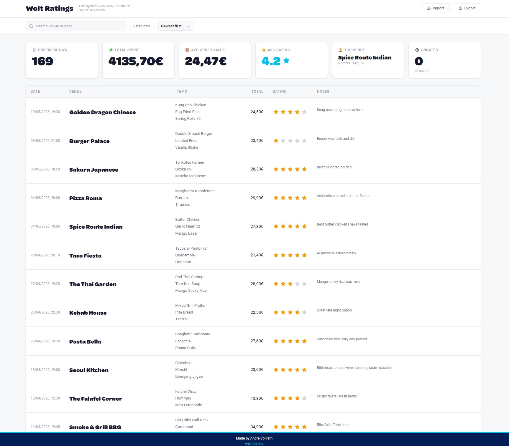
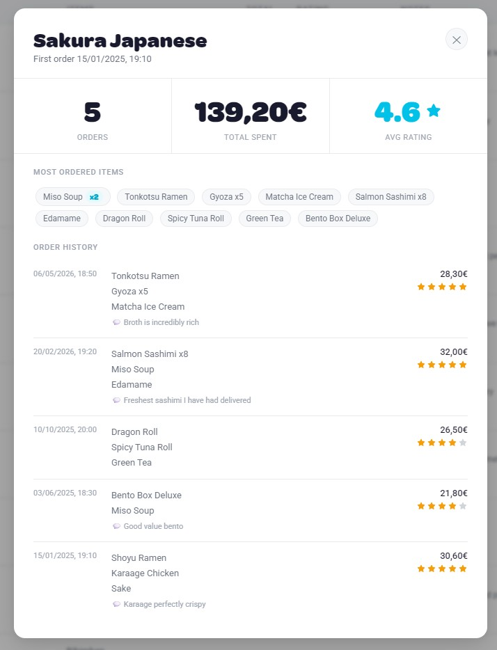
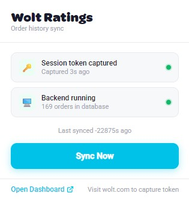

# Wolt Ratings

> *Because "I think I liked that place?" isn't good enough.*

I order on Wolt a lot. After a while I noticed I kept reordering from restaurants I'd forgotten I didn't enjoy, and skipping ones I'd loved but couldn't remember. Wolt shows you your order history — but it gives you no way to annotate it. No stars, no notes, no memory.

So I built one.

**Wolt Ratings** is a local-first tool that pulls your complete order history into a personal dashboard where you can rate every order 1–5 stars and leave notes for your future self. *"The garlic sauce is elite here."* *"Ask for extra spicy next time."* *"Never again."* It lives entirely on your machine — your data never touches a third-party server.

<p align="center">
  
  <br/>
  <em>The full order history dashboard — searchable, sortable, and fully annotatable.</em>
</p>

---

## How it works

Three components, each doing one job:

```
┌─────────────────────┐     POST /sync      ┌──────────────────────┐     GET /orders     ┌──────────────────┐
│  Chrome Extension   │ ──────────────────► │   Python / Flask     │ ──────────────────► │  Vanilla JS UI   │
│  Captures JWT from  │                     │   orders_db.json     │ ◄────────────────── │  localhost:5000  │
│  wolt.com localStorage                    │   Non-destructive    │     POST /update    │  Stars + Notes   │
└─────────────────────┘                     │   merge engine       │                     └──────────────────┘
                                            └──────────────────────┘
```

**The extension** injects a content script into wolt.com that reads your session token directly from the page's localStorage — no login scraping, no password required. One click of "Sync Now" fetches your full order history from Wolt's API and sends it to your local backend.

**The backend** (Flask + a plain JSON file) merges incoming orders intelligently: new orders are added, existing ones are never overwritten. Your ratings and notes are safe no matter how many times you sync.

**The dashboard** is a clean, searchable table. Click stars to rate, click the notes field to annotate. Everything saves instantly on interaction.

---

## Features

### Dashboard
- **Stats bar** — live cards showing orders shown, total spent, average order value, average rating (with decimal precision), top venue with order count and total spend, and unrated order count
- **Venue modal** — click any restaurant name to see a full breakdown: total orders, money spent, average rating, most-ordered items, and a complete order history with per-order ratings and notes
- **SVG star ratings** — click to rate 1–5 stars; hover previews the selection; saves immediately
- **Free-text notes** — annotate any order; saves on blur
- **Search** — filter by restaurant name or dish in real time
- **Rated only filter** — show only orders that have been rated
- **Sort** — newest first, oldest first, highest rated, highest value, venue A–Z
- **Infinite scroll** — orders load in batches of 25 as you scroll
- **Export** — download your full database as `orders_db.json`
- **Import** — load a previously exported JSON file to merge orders across devices; existing ratings and notes are preserved
- **European number format** — amounts displayed as `14,68€`
- **Custom Voltymore font** for headings; Roboto for body text

<p align="center">
  
  <br/>
  <em>The venue modal — per-restaurant stats, most-ordered items, and your full visit history at a glance.</em>
</p>

### Extension
- **One-click sync** — captures your Wolt session token automatically via content script
- **Token validity indicator** — green dot when credentials are fresh, grey icon when expired
- **Server status check** — shows backend order count and last sync time before you sync
- **Sync summary** — reports new orders added vs. already in database
- **Voltymore font** in the popup header

<p align="center">
  
  <br/>
  <em>The extension popup — token status, server health, and one-click sync.</em>
</p>

### Backend
- **Non-destructive merge** — re-syncing never overwrites ratings or notes
- **`/import` endpoint** — merge a full JSON export back into the database
- **`/health` endpoint** — used by the extension to check server status

---

## Stack

| Layer | Technology |
|-------|------------|
| Extension | Chrome / Edge MV3, content script, service worker |
| Backend | Python 3, Flask, Flask-CORS, plain JSON file |
| Frontend | Vanilla JS, custom CSS (no framework, no build step) |
| Font | Voltymore (headings), Roboto (body) |

No Node.js. No npm. No bundler. Just `python backend/app.py` and you're running.

---

## Getting started

### Prerequisites

| Tool | Version |
|------|---------|
| Python | 3.10+ |
| Chrome or Edge | 88+ (Manifest V3) |

### 1. Clone the repo

```bash
git clone https://github.com/avollrath/wolt-ratings.git
cd wolt-ratings
```

### 2. Install Python dependencies

```bash
pip install flask flask-cors
```

### 3. Start the backend

```bash
python backend/app.py
```

The server starts at `http://localhost:5000`. The dashboard is served from the same process — open it in your browser.

### 4. Install the browser extension

1. Go to `chrome://extensions` (or `edge://extensions`)
2. Enable **Developer mode** (toggle, top-right)
3. Click **Load unpacked** → select the `extension/` folder

The Wolt Ratings icon appears in your toolbar. Pin it for easy access.

> To regenerate the extension icons (cyan circle with white star), run `python generate_icons.py` from the project root.

---

## Usage

### Syncing your orders

1. Open **[wolt.com](https://wolt.com)** and let the page fully load
2. Click the **Wolt Ratings** toolbar icon — the auth indicator should show green: *"Credentials captured"*
3. Click **Sync Now**
4. The popup reports how many new orders were added
5. Open `http://localhost:5000` — your full order history is there

> **No green dot?** Navigate to your [Wolt order history](https://wolt.com/en/me/order-history) and reload. The content script picks up your token on page load.

> **Token expired?** Wolt JWTs last ~30 minutes. If you get a sync error, reload wolt.com and sync again.

### Rating and annotating

- **Stars** — click any star on a row. Saves immediately.
- **Notes** — click the notes field, type, click away. Saves on blur.
- **Unrated card** — click the "Unrated" stat card to instantly filter to all orders without a rating.

### Exporting and importing

- **Export** — click the Export button in the header to download `orders_db.json`
- **Import** — click the Import button and select a JSON file. New orders are merged in; any existing ratings and notes are kept.

---

## Project structure

```
wolt-ratings/
├── extension/
│   ├── manifest.json       # MV3 config — permissions, content script
│   ├── background.js       # Service worker: stores credentials, runs sync
│   ├── content.js          # Injected into wolt.com: reads JWT from localStorage
│   ├── popup.html          # Extension popup UI (Voltymore font, inline styles)
│   ├── popup.js            # Status check, sync trigger, result display
│   ├── Voltymore.ttf       # Bundled font for popup
│   └── icons/              # PNG icons at 16, 48, 128px
│
├── backend/
│   ├── app.py              # Flask server: /sync, /import, /update, /orders, /export, /health
│   ├── example_orders.json # 169 example orders across 20 generic restaurants
│   └── orders_db.json      # Your data — auto-created on first sync (gitignored)
│
├── frontend/
│   ├── index.html          # Dashboard: markup, all CSS, stat cards, modal, toasts
│   ├── app.js              # Fetch, filter, sort, render, infinite scroll, save
│   ├── fonts.css           # @font-face for Voltymore
│   ├── favicon.ico         # Cyan circle + white star (16/32/48px)
│   └── favicon.png         # 32px PNG favicon
│
├── font/
│   └── Voltymore.ttf       # Custom display font (used for headings)
│
├── screenshots/
│   ├── dashboard.jpg
│   ├── venue_modal.jpg
│   └── extension.jpg
│
├── generate_icons.py       # Regenerates favicons and extension icons via Pillow
└── README.md
```

---

## API reference

| Method | Endpoint | Description |
|--------|----------|-------------|
| `GET` | `/` | Serves the frontend dashboard |
| `GET` | `/orders` | Returns the full database as JSON |
| `POST` | `/sync` | Merges incoming Wolt API orders; returns diff summary |
| `POST` | `/import` | Merges a full exported JSON file; preserves existing ratings/notes |
| `POST` | `/update` | Patches `rating` and/or `notes` for one order |
| `GET` | `/export` | Downloads `orders_db.json` as a file attachment |
| `GET` | `/health` | Server status and total order count |
| `GET` | `/font/<filename>` | Serves font files from the `font/` directory |

**`POST /sync` · `POST /import` response:**
```json
{
  "new_orders": 3,
  "total_orders": 50,
  "last_synced": "2026-05-13T10:00:00+00:00"
}
```

**`POST /update` request:**
```json
{
  "purchase_id": "abc123",
  "rating": 4,
  "notes": "A bit too spicy — ask for medium next visit."
}
```

---

## Data schema

`backend/orders_db.json`:

```json
{
  "last_synced": "2026-05-13T10:00:00+00:00",
  "orders": [
    {
      "purchase_id": "unique_id_string",
      "venue_name": "Golden Dragon Chinese",
      "received_at": "10/05/2026, 19:30",
      "items": "Kung Pao Chicken and Egg Fried Rice and Spring Rolls x2",
      "total_amount": "€24.50",
      "status": "delivered",
      "user_custom_data": {
        "rating": 4,
        "notes": "Kung pao had great heat level.",
        "last_edited": "2026-05-11T08:00:00+00:00"
      }
    }
  ]
}
```

---

## License

MIT — do whatever you want with it.
